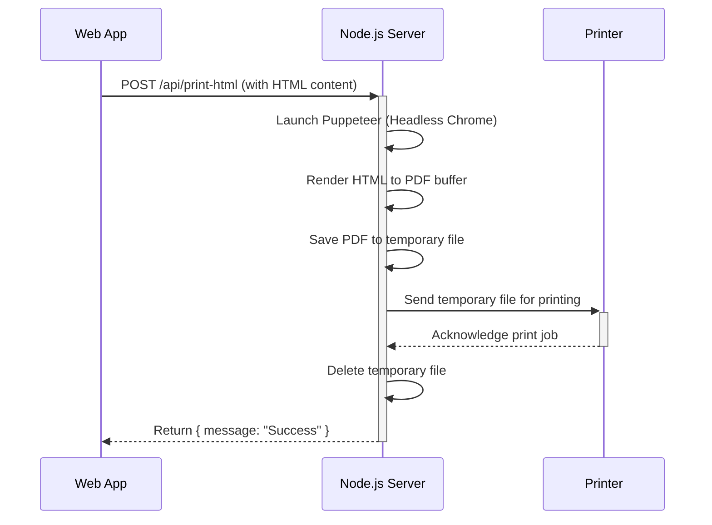
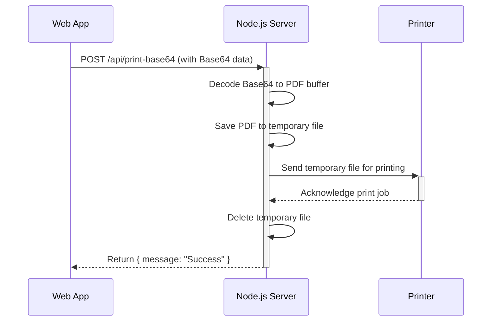

# Node.js Print Server

A simple yet powerful print server built with Node.js. It converts raw HTML to high-quality, vector-based PDFs using Puppeteer and sends print jobs to any configured system printer. It also supports direct printing of existing PDF files from Base64-encoded data, making it a versatile solution for web-based printing workflows.

---

## Table of Contents

- [Features](#features)
- [Web Interface for Testing](#web-interface-for-testing)
- [Key Concepts for Junior Developers](#key-concepts-for-junior-developers)
- [Logic Breakdown](#logic-breakdown)
  - [High-Quality Printing Flow (`/api/print-html`)](#high-quality-printing-flow-apiprint-html)
  - [Base64 Printing Flow (`/api/print-base64`)](#base64-printing-flow-apiprint-base64)
  - [Printer Discovery Flow (`/api/printers`)](#printer-discovery-flow-apiprinters)
- [How to Use (API Guide)](#how-to-use-api-guide)
  - [GET /api/printers](#get-apiprinters)
  - [POST /api/print-html](#post-apiprint-html)
  - [POST /api/print-base64](#post-apiprint-base64)
- [Demo](#demo)
- [Prerequisites](#prerequisites)
- [Installation](#installation)
- [Running the Server](#running-the-server)
- [Production Deployment with PM2](#production-deployment-with-pm2)
- [Development Tips](#development-tips)
- [Troubleshooting](#troubleshooting)
- [License](#license)

---

## Features

- **High-Quality PDF Generation**: Converts raw HTML to a vector-based PDF with selectable text using Puppeteer.
- **Base64 PDF Printing**: Directly prints PDF files provided as a Base64 string.
- **Dynamic Printer Selection**: An API endpoint is provided to fetch all printers available on the host machine.
- **CORS Enabled**: Ready for cross-origin requests from any web front-end.
- **Cross-Platform**: Uses the excellent [`pdf-to-printer`](https://www.npmjs.com/package/pdf-to-printer) library for broad compatibility.
- **Lightweight**: Built with Express.js for a minimal footprint.
- **Simple Web Interface**: Includes a web-based UI for easy testing and printer discovery.

---

## Web Interface for Testing

This server includes a simple, built-in web interface to make setup and testing as easy as possible.

**Once the server is running, open your web browser and navigate to:**

[http://localhost:3000](http://localhost:3000)

The control panel allows you to:
-   **Fetch Printers**: Click the "Refresh Printer List" button to see all printers available to the server.
-   **Send Test Jobs**: Write or paste HTML into the text area, select a printer, and click "Print" to send a test page.

This is the recommended way to verify that your server is running correctly and can communicate with your printers.

---

## Key Concepts for Junior Developers

This section explains the core ideas behind the print server in a beginner-friendly way.

### What Problem Does This Server Solve?

Web browsers can print, but they lack control. You can't easily choose a specific printer, set paper sizes reliably, or print from a server without user interaction. This project solves that by creating a "bridge" between a web application and a physical printer.

- **Your Web App (Client)**: A user clicks a "Print" button.
- **This Node.js Server (Bridge)**: Receives the print request from your app.
- **Physical Printer**: The server sends the job to the correct printer.

### What is a Headless Browser (Puppeteer)?

**Puppeteer** is a tool that lets us control a real Chrome/Chromium browser from our Node.js code. "Headless" means the browser runs invisibly in the background, without a graphical user interface (GUI).

We use it for the `/api/print-html` route to do something very clever:
1. We give it raw HTML.
2. It "renders" that HTML exactly like a real browser would, including CSS styles and images.
3. It then "prints" the rendered page to a perfect, high-quality PDF.

This is much better than trying to create a PDF from scratch because it leverages the powerful rendering engine of a modern web browser.

### Understanding `async/await` (Asynchronous Operations)

Printing is not instant. It involves waiting for things to happen:
- The headless browser needs time to start up and load the HTML.
- Saving a file to disk takes a moment.
- Sending the file to the printer queue takes time.

In JavaScript, we use `async` and `await` to handle these delays without freezing the entire server.

- `async function`: Marks a function that contains time-consuming operations.
- `await`: Pauses the function execution until a specific, time-consuming task (like `puppeteer.launch()` or `fs.promises.writeFile()`) is complete.

This ensures the server can still handle other incoming requests while it waits for a print job to finish.

---

## Logic Breakdown

This section details the step-by-step process the server follows for each API request.

### High-Quality Printing Flow (`/api/print-html`)

This is the most powerful feature of the server. It converts raw HTML into a perfect, vector-based PDF.



1.  **Receive Request**: The server receives a POST request containing `htmlContent`, and optionally `paperSize` and `printerName`.
2.  **Launch Headless Browser**: It starts an invisible instance of the Chromium browser using **Puppeteer**.
3.  **Render HTML**: A new virtual page is created, and the `htmlContent` is loaded into it. The server waits for all assets (images, stylesheets) to finish loading.
4.  **Generate PDF**: The server instructs the browser to "print" the page to a PDF buffer in memory. This process generates a high-fidelity, vector-based PDF with selectable text.
5.  **Create Unique Temp File**: The PDF buffer is saved to a temporary file in the `Server` directory. The filename is guaranteed to be unique by using the `uuid` library (e.g., `temp_print_a1b2c3d4.pdf`), which prevents conflicts if multiple requests are processed simultaneously.
6.  **Send to Printer**: The `pdf-to-printer` library sends the temporary PDF file to the specified `printerName` or the system's default printer.
7.  **Cleanup**: The temporary PDF file is deleted immediately after being sent to the print queue.
8.  **Send Response**: A success message is sent back to the client.

### Base64 Printing Flow (`/api/print-base64`)

This flow is for printing a PDF that has already been created, typically by the client's browser.



1.  **Receive Request**: The server receives a POST request with `base64Data` and an optional `printerName`.
2.  **Decode Data**: The Base64 string is decoded back into its raw binary PDF format.
3.  **Create Unique Temp File**: The binary data is saved to a unique temporary file (e.g., `temp_print_e5f6g7h8.pdf`).
4.  **Send to Printer & Cleanup**: The process is the same as in the high-quality flow: the file is printed, then deleted.
5.  **Send Response**: A success message is returned.

### Printer Discovery Flow (`/api/printers`)

This endpoint allows a front-end application to discover which printers are available.

1.  **Receive Request**: The server receives a GET request.
2.  **Query System Printers**: The `pdf-to-printer` library queries the underlying operating system for a list of all installed and available printers.
3.  **Send Response**: The server returns a JSON array of printer objects, each containing a `deviceId` and `name`.

---

## API Guide

### GET /api/printers

Retrieves a list of all printers installed and recognized on the host machine.

*   **Response (Success):**
    ```json
    [
      { "deviceId": "Microsoft_Print_to_PDF", "name": "Microsoft Print to PDF" },
      { "deviceId": "My_HP_LaserJet", "name": "My HP LaserJet" }
    ]
    ```
*   **Response (Error):**
    ```json
    { "error": "Failed to get printers.", "details": "..." }
    ```
*   **Example (`curl`):**
    ```bash
    curl http://localhost:3000/api/printers
    ```

### POST /api/print-html

Generates a high-quality PDF from raw HTML and sends it to a printer.

*   **Request Body:**
    ```json
    {
      "htmlContent": "<html><body><h1>Hello, world!</h1></body></html>",
      "paperSize": "a4",
      "printerName": "My_HP_LaserJet",
      "printerOptions": {
        "copies": 2
      }
    }
    ```
    - `htmlContent` (string, required): The raw HTML to be rendered.
    - `paperSize` (string, optional): Defaults to `a4`. Other values like `letter`, `legal`, `a5` are supported.
    - `printerName` (string, optional): The name of the target printer. If omitted, the system's default printer is used.
    - `printerOptions` (object, optional): An object containing additional options to pass directly to the `pdf-to-printer` library (e.g., `{ copies: 3 }`).

*   **Response (Success):**
    ```json
    { "message": "High-quality print job sent successfully!" }
    ```
*   **Example (`curl`):**
    ```bash
    curl -X POST http://localhost:3000/api/print-html \
         -H "Content-Type: application/json" \
         -d '{"htmlContent": "<h1>Hello from cURL!</h1>", "paperSize": "a4"}'
    ```

### POST /api/print-base64

Prints an existing PDF provided as a Base64-encoded string.

*   **Request Body:**
    ```json
    {
      "base64Data": "JVBERi0xLjQKJcTl8uXr...",
      "printerName": "My_HP_LaserJet",
      "printerOptions": {
        "copies": 2
      }
    }
    ```
    - `base64Data` (string, required): The Base64-encoded content of the PDF file.
    - `printerName` (string, optional): The target printer name. Defaults to the system default.
    - `printerOptions` (object, optional): An object containing additional options to pass directly to the `pdf-to-printer` library (e.g., `{ copies: 3 }`).

*   **Response (Success):**
    ```json
    { "message": "Base64 print job sent successfully!" }
    ```
*   **Example (`curl`):**
    *Note: The `base64Data` would be a very long string.*
    ```bash
    curl -X POST http://localhost:3000/api/print-base64 \
         -H "Content-Type: application/json" \
         -d '{"base64Data": "JVBERi0xLjQKJ...", "printerName": "Microsoft_Print_to_PDF"}'
    ```


## Production Deployment with PM2

For running this server in a production environment, using a process manager like [PM2](https://pm2.keymetrics.io/) is highly recommended. PM2 keeps your server online by automatically restarting it if it crashes and provides tools for monitoring and managing the process.

### Easy Management with `manage.bat` (For Windows Users)

This project includes a `manage.bat` script to simplify all common tasks for Windows users. Simply double-click the file and choose an option from the menu.

**Available Options:**
-   **Install Dependencies**: Runs `npm install` and installs PM2 globally.
-   **Start Server**: Starts the server in production mode using PM2.
-   **Stop/Restart/Delete Server**: Manages the running server instance.
-   **View Logs**: Displays the latest logs.
-   **Enable/Disable Auto-Startup**: Configures the server to run automatically when the system boots.

### Manual Management (For All Platforms)

This project includes a pre-configured PM2 setup. Here’s a step-by-step guide to get it running.

#### Step 1: Install PM2

If you don't already have PM2, install it globally using npm:
```bash
npm install pm2 -g
```

#### Step 2: Start the Application

The project includes an `ecosystem.config.cjs` file in the `Server` directory, which is the standard configuration file for PM2.

To start the server in production mode, run the following command from the **project root directory**:
```bash
# From the project root
npm run start:prod
```
This command executes `npx pm2 start Server/ecosystem.config.cjs` and will launch the server in the background.

#### Step 3: Manage the Application

Once the server is running, you can manage it with these commands, all run from the **project root directory**:

*   **Check Status**: See the status of all running processes managed by PM2.
    ```bash
    npm run status:prod
    # or
    pm2 list
    ```
*   **View Logs**: PM2 is now configured to store all logs in the `Server/logs/` directory, with timestamps. This is the best place to look for errors. You can tail them with:
    ```bash
    npm run logs:prod
    # or
    npx pm2 logs print-server
    ```
*   **Stop the Server**:
    ```bash
    npm run stop:prod
    # or
    pm2 stop print-server
    ```
*   **Restart the Server**:
    ```bash
    pm2 restart print-server
    ```
*   **Delete the Server**: Completely remove the server from PM2's list of processes. This is useful for a clean shutdown or before re-configuring.
    ```bash
    npm run delete:prod
    # or
    pm2 delete print-server
    ```

### Step 4: Enable Startup on Reboot (Crucial for Production)

To ensure your print server automatically restarts when the server reboots, you need to set up the PM2 startup script.

1.  **Generate the Startup Command**:
    Run the following command and PM2 will provide you with a command to copy and paste.
    ```bash
    pm2 startup
    ```
    It will output a line similar to this (the exact command depends on your OS):
    `sudo su -c "env PATH=$PATH:/home/user/.nvm/versions/node/v18.12.1/bin pm2 startup <distribution> -u <user> --hp <home-path>"`

2.  **Execute the Command**:
    Copy the command provided by `pm2 startup` and run it in your terminal. This registers PM2 as a system service.

3.  **Save the Process List**:
    Finally, save the current list of running processes so PM2 knows to restart them on reboot.
    ```bash
    pm2 save
    ```

Your print server is now fully configured to run as a persistent background service.

---

## Development Tips

- **Headless Linux:** On Linux servers without a GUI, Puppeteer may require additional launch arguments:
  ```js
  browser = await puppeteer.launch({
    args: ['--no-sandbox', '--disable-setuid-sandbox']
  });
  ```
- **Security:** If this server is ever exposed to the public internet, you **must** implement security measures (e.g., authentication, input sanitization) to prevent abuse, especially for the `/api/print-html` endpoint.

---

## Troubleshooting

- **`ERR_MODULE_NOT_FOUND`**: Ensure you have run `npm install` from the **project root** directory.
- **Puppeteer Download Issues**: A stable internet connection is required for the first `npm install`, as it downloads a compatible version of Chromium.
- **Printer Not Found**: Verify the printer name is correct and that the printer is accessible to the user account running the Node.js process. Use the `/api/printers` endpoint to get a list of valid names.

---

## License

This project is licensed under the MIT License.
